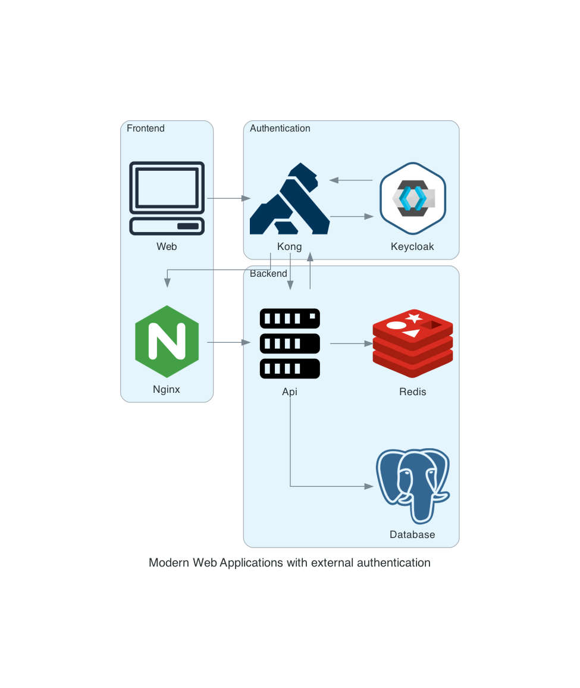

# Data FullStack Application

Pour commencer :

## [Docker](docker/DOCKER.md)

Pour l'ensemble des parties du cours

## API 
### [Cours](api/README.md)  
### [TP](api/tp/README.md)

## Front 
### [Cours](front/README.md)  
### [TP](front/tp/README.md)

## Authentification : Keycloak
### [Cours](authentication/README.md)  
### [TP](authentication/tp/README.md)

## Api Gateway : Kong
### [Cours](kong/README.md)
### [TP](kong/tp/README.md)